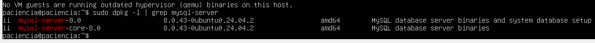
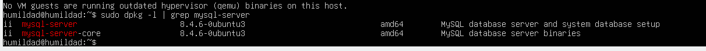
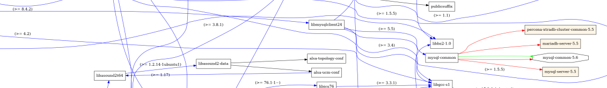

# UP02-DebTree-Paciencia y Humildad

### Instalamos debtree en las dos masquinas con el siguiente comando:

````bash
sudo apt install debtree -y
````

### Ahora en la maquina Paciencia instalamos la version de sql 8.0 con el siguiente comando:

````bash
sudo apt install mysql-server-8.0
````

### Comprobamos le version de empaquetado que tiene que ser 8.0.43-0ubuntu0.24.04.2 



### Y en la maquina Humildad instalamos la version 8.4ubuntu3 con el siguiente comando:

````bash
sudo apt install mysql-server=8.4.6-0ubuntu3
````

### Comprobamos le version de empaquetado que tiene que ser 8.4.6-0ubuntu3 



### Este es el diagrama con el debtree que vemos que en el paquete "libmysqlclient21" necesita la version >= a la 8.4.2



### Y en este sale lo mismo pero con la version >= 8.0.11


### La conclusion es que se instalaran diferentes versiones de patator por los paquetes que tiene el mysql, pero ninguno de estos va a tener problemas, mientras se instale la version que requiere el paquete

# DAVID MORENO RODRIGUEZ
